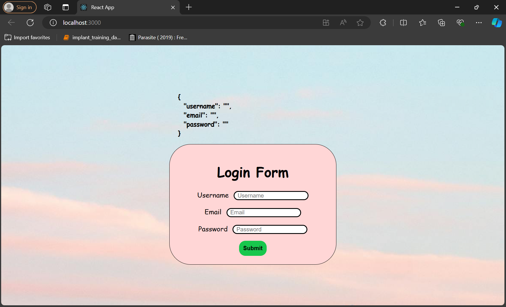

# React-Form-Validation
**OUTPUT**

## This is normal form validation using Reactjs.

### If you are new with the ReactJS go to validate-form folder you will see new readme file where you can follow steps and install, start with basic commands.
- Start with the **npx create-react-app "project_name"** in the VS Code Terminal.
- after creating, hit **npm start** command to run the project.
- and boom you are ready with a form using ReactJs.
